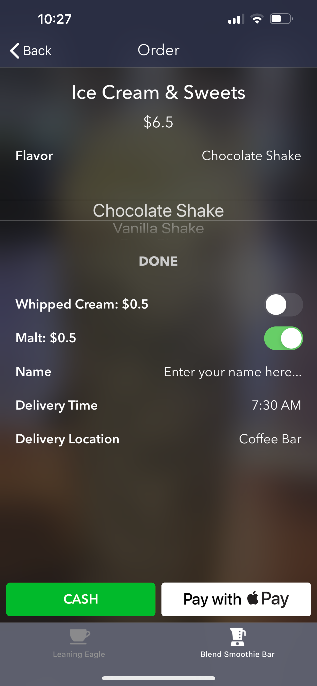

# BlendSmoothieBar

BlendSmoothieBar is an app created for the joint Leaning Eagle coffee bar and Blend smoothie bar, student-run businesses at Cincinnati Hills Christian Academy. This app provides a means for students from across the high school to order beverages in advance and even have them delivered straight to their classrooms. 

It features the latest technologies including Apple Pay and Stripe, leverages Amazon Web Service's Lambda cloud function service as well as CloudKit's database, and has multiple redundancies in place to ensure that if any one of these systems fail, the customer is not charged. Further, Firebase Analytics is used to track how much of each drink is being sold, allowing the coffee bar to adjust its menu accordingly.

The entire app is focused around a design that features the unique traits of the Leaning Eagle, including the ever-popular milkshkes students love, in a way that a customer can order a drink within three taps. This minimizes friction, increases orders, and allows students to purchase a beverage in the tight time before class.

## Screenshots

